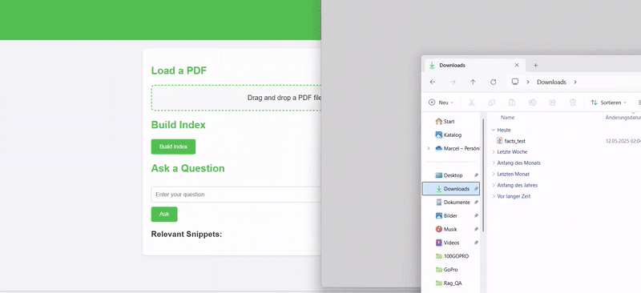

# RAG QA System

This project implements a Retrieval-Augmented Generation (RAG) system for question answering over PDF documents. It combines semantic search with a question-answering model to provide accurate, context-aware answers based on your uploaded PDF.

## Features

- **Drag-and-drop PDF upload:** Easily upload your PDF file via a modern web interface.
- **Semantic search:** Uses `all-mpnet-base-v2` embeddings and FAISS for fast, relevant snippet retrieval.
- **Contextual QA:** Answers questions using `deepset/roberta-base-squad2` with context from your documents.
- **Snippet display:** Shows the relevant text snippets used to generate each answer.
- **Automatic cleanup:** Uploaded files are deleted when the page is reloaded for privacy and storage efficiency.

## Demo



## Requirements

Install the required Python libraries:

```bash
pip install -r requirements.txt
```

## Usage

1. **Start the server:**
    ```bash
    python main.py
    ```

2. **Open your browser** and go to [http://localhost:5000](http://localhost:5000).

3. **Upload a PDF:** Drag and drop a PDF file into the upload area.

4. **Build the index:** Click "Build Index" after uploading.

5. **Ask questions:** Enter your question and click "Ask" to get an answer and see the relevant snippets.
